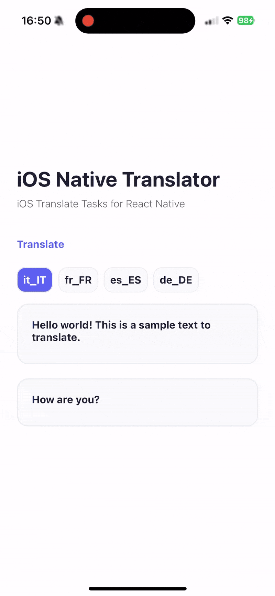

# React Native iOS Translate Tasks

<p align="center">
  A React Native library that brings the native iOS 18+ Translation Tasks to your React Native applications.
</p>

<p align="center">
  <a href="https://github.com/huextrat/react-native-ios-translate-tasks/blob/main/LICENSE">
    
  </a>
  <a href="https://www.npmjs.com/package/react-native-ios-translate-tasks">
    
  </a>
  <a href="https://www.npmjs.com/package/react-native-ios-translate-tasks">
    
  </a>
</p>

> **Note**: If you want to display a native iOS sheet, you can use [react-native-ios-translate-sheet](https://github.com/huextrat/react-native-ios-translate-sheet) which provides a native UI for translation settings.

## Features

- 🔄 Seamless integration with iOS native translation capabilities
- 🌐 Access to all languages supported by iOS translation
- 📱 Native iOS UI and interactions
- 🏗️ Supports old & new arch on RN 0.76+
- ⚙️ Powered by SwiftUI's [translationTask](https://developer.apple.com/documentation/swiftui/view/translationtask(source:target:action:)) API under the hood

## Platform Compatibility

This library is designed specifically for iOS 18.0 and above. It can be safely installed in your React Native project regardless of your target iOS version or if you're developing for Android. However, please note:

- On iOS versions below 18.0, the translation taks will throw an error
- On Android devices, the translation functionality is not available and will throw an error

## Installation

```sh
yarn add react-native-ios-translate-tasks
```
or
```sh
npm install react-native-ios-translate-tasks
```

Then, install the native dependencies:

```sh
cd ios && pod install
```

## Usage

1. First, wrap your app (or the part where you want to use the translation tasks) with the `IOSTranslateTasksProvider`:

```tsx
import { IOSTranslateTasksProvider } from 'react-native-ios-translate-tasks';

function App() {
  return (
    <IOSTranslateTasksProvider>
      {/* Your app content */}
    </IOSTranslateTasksProvider>
  );
}
```

2. Then, use the `useIOSTranslateTasks` hook in any component where you want to trigger translation tasks:

```tsx
import { useIOSTranslateTasks } from 'react-native-ios-translate-tasks';

function MyComponent() {
  const { startIOSTranslateTasks } = useIOSTranslateTasks();

  const enText = "Hello world! This is a sample text to translate.";
  const enText2 = "How are you?";

  const handleTranslate = async () => {
    try {
      const { translatedTexts } = await startIOSTranslateTasks(
        [enText, enText2],
        {
          sourceLanguage: "en_EN",
          targetLanguage: "fr_FR",
        },
      );
      console.log(translatedTexts); // ["Salut le monde ! Ceci est un exemple de texte à traduire.", "Comment allez-vous ?"]
    } catch (e) {
      console.log(e);
    }
  };

  return (
    <Button 
      title="Translate" 
      onPress={handleTranslate} 
    />
  );
}
```

The `translatedTexts` array in the response will maintain the same order as the input texts array. This means that if you pass `["Hello", "World"]`, the response will contain translations in the corresponding order (e.g., `["Bonjour", "Monde"]` for French). This ordering guarantee makes it easy to map translations back to their original texts.

### Checking Platform Support

The `useIOSTranslateTasks` hook provides an `isSupported` boolean that you can use to check if the translation functionality is available on the current device:

```tsx
const { isSupported } = useIOSTranslateTasks();
```

Note: The translation tasks will only run on iOS devices running version 18.0 or later. On other platforms or iOS versions below 18.0, the `startIOSTranslateTasks` function will throw an error.

## Important Notes

### Language Downloads
When using the translation feature for the first time with a specific language, iOS may display a sheet asking the user to download the required language pack. The user must complete this download for translations to work.

### Error Handling
Several types of errors may occur during translation:

1. If the user cancels the language download sheet, an error will be thrown
2. Invalid language codes will result in an error. Make sure to use valid Unicode language identifiers (e.g., "en-US", "fr_FR", "es-419", "zh-Hant-TW")
3. If either the source or target language is not supported, an error will be thrown

### Simulator Support
Please note that this feature does not work on iOS simulators. It requires a physical iOS device running version 18.0 or later to function properly.

## Example

<center>

</center>

## Contributing

We welcome contributions! Please see our [Contributing Guide](CONTRIBUTING.md) for more details.

## License

This project is licensed under the MIT License - see the [LICENSE](LICENSE) file for details.

## Support

If you like this project, please consider supporting it by giving it a ⭐️ on GitHub!
